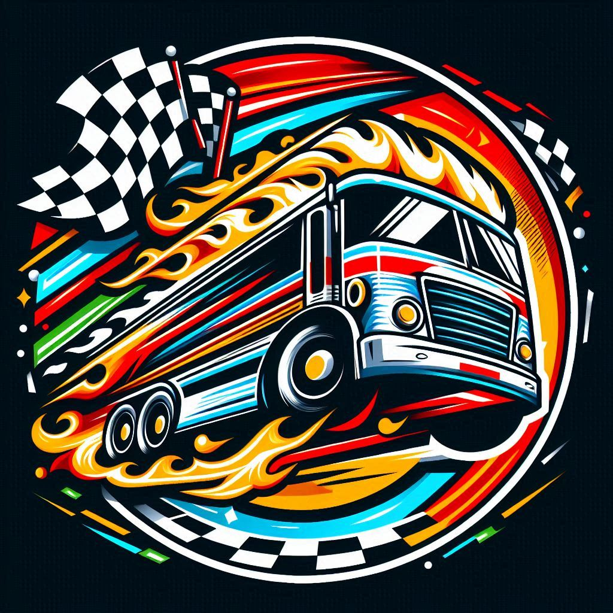

# Carrera de Buses Web
Este proyecto Web simula una emocionante carrera entre dos buses: Red Bull y Monster, utilizando JavaScript
## [Carrera de Buses Web](https://nahuelfran.github.io/Carrera-Buses/index.html)

## Carrera de Buses en Python (Original)

Este proyecto simula una emocionante carrera entre dos buses: Red Bull y Monster, utilizando Python para crear una animación en la consola.

## Descripción
La animación muestra el avance de los buses de forma aleatoria hasta que uno de ellos cruza la meta. El código está diseñado para ser fácil de entender y modificar, lo que lo convierte en una excelente oportunidad para quienes desean practicar programación y explorar la lógica de simulaciones.

## Créditos
**Autor Original Version Python:** Nilver T.I  
**Autor version Web:** Francis R.G.
